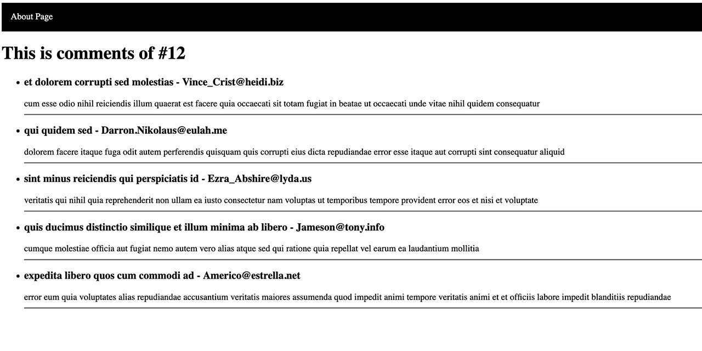

<div>
  <h1 align="center">This is is a server-side project in NextJS 🧑‍💻</h1>
  <strong>
   Fetching data can be time consuming when we do it on the client side.
  </strong>
  <p>
    Therefore, this is one of the reasons we use NextJS
  </p>

  <a href="">
    
  </a>
</div>

<hr />

# This is is a server-side project in NextJS
 Fetching data can be time consuming when we do it on the client side.
 Therefore, this is one of the reasons we use NextJS
 For fetching data I used axios


**Goal:**

- Our goal is to learn how to use server-side function in NextJS by using getInitialProps()
- & How to override the default App in order to use repetitive content on pages like Navbar.

# How to use getInitialProps()
This is a sample of using it:
```javascript
index.getInitialProps=async()=>{
   
    const res = await axios.get('https://jsonplaceholder.typicode.com/posts')
    const posts = res.data
    return { posts: posts }
}
```

# How to use custom App in NextJS
When we have repetitive content on pages, like header and footer, instead of importing it in all pages, we can use a simple way by overriding the _app.js, we just need to create a file in ./pages/_app.js, in the following every content **`before`** component, will load at the beginning of every page and every content **`after`** that, will be load at the end.

```javascript
import Navbar from "./Navbar"
export default function MyApp({ Component, pageProps }) {
    return (
    <div>
      <Navbar />
    <Component {...pageProps} />
    </div>)
  }
```

**Techs:**

- React.js
- NextJS
- Axios
- CSS
- HTML


** API **

- [https://jsonplaceholder.typicode.com/posts/](https://jsonplaceholder.typicode.com/posts/)

# Notes

Prerequisites:

- Nodejs must be installed in your unit.
- NPM must be installed in your unit
- Have basic knowledge about React.js / Next.js framework

### DISCLAIMER: THIS IS NOT A REACT.JS BEGGINNERS GUIDE/TUTORIAL


In the project directory, you can run bellow command to install all dependencies:

### `npm i`


To run this app:

### `npm run dev`

